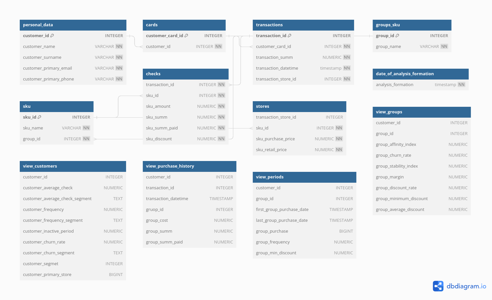

# RetailAnalistycsDB

Структура базы данных для проекта анализа розничной торговли

## Содержание

В проекте реализована структура базы данных с различными функциями, процедурами и триггерами.
Также есть импорт и экспорт в файлы tsv.
Помимо стандартных таблиц создаются презентационные таблицы, содержащие необходимую
информации (их структура указана на схеме).

## Структура

[диаграмма](https://dbdiagram.io/d/64f8113d02bd1c4a5e0c34af)

Описание процедур, функций и триггеров — в комментариях в самом коде.

1. Для перемещения импортируемых файлов tsv `make move`
2. Чтобы создать базу данных `make create`
3. Чтобы удалить базу данных, выполните команду make drop.
4. Чтобы переместить tsv-файлы и создать базу данных `make`